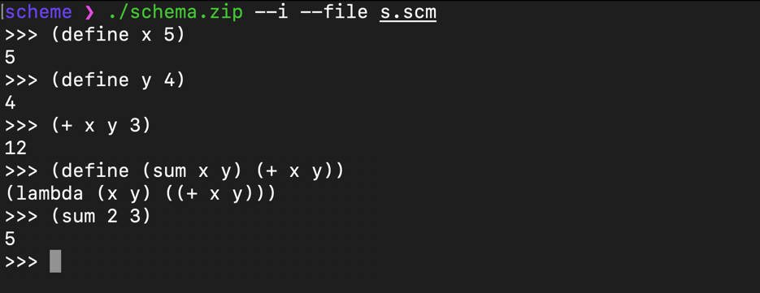

# Schema.zip

This is a simple interpreter for the Scheme programming language written in Scala. It supports basic Scheme features
such as arithmetic operations, conditionals, and function definitions.

## Usage

The interpreter also supports the following command-line options:

- `--i`: Launches the REPL (Read-Evaluate-Print Loop), which allows you to interactively enter and evaluate Scheme
  expressions.
- `--file <filename>`: Reads the Scheme program from the specified file and executes it.

For example, to launch the REPL, run:

`schemezip  --i`

To execute a Scheme program from a file named myprogram.scm, run:

`schemezip --file myprogram.scm --i`

## Supported Features

The interpreter supports the following Scheme R5RS features:

| Feature    | Supported          |
|------------|--------------------|
| define     | :heavy_check_mark: |
| lambda     | :heavy_check_mark: |
| arithmetic | :heavy_check_mark: |
| lists      | :heavy_check_mark: |
| vectors    | :x:                |
| macros     | :x:                |
| call/cc    | :x:                |

## Running Tests

The interpreter comes with a suite of tests to ensure that it works correctly. To run the tests, run the Test class:

`sbt test`

## License

This project is licensed under the MIT License - see the LICENSE file for details.